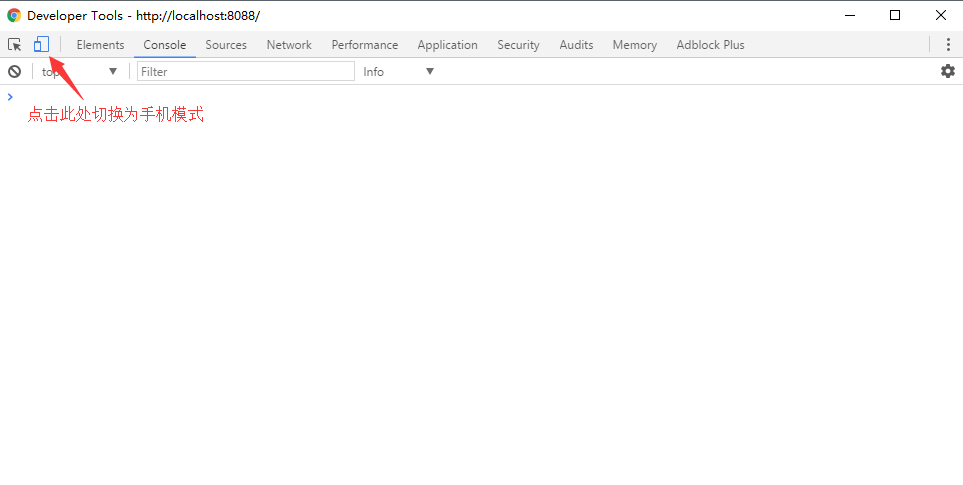
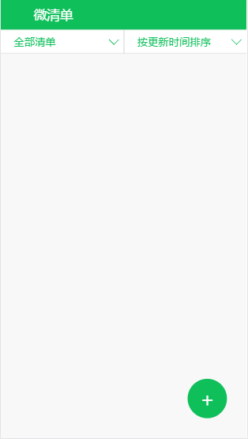
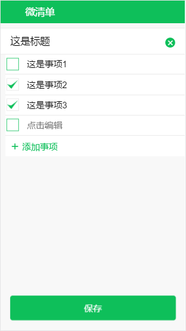
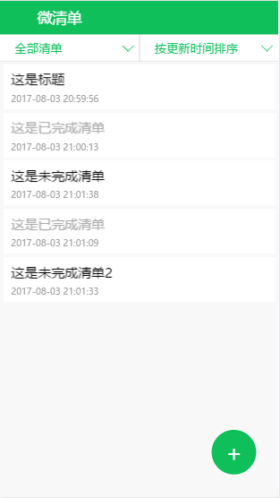
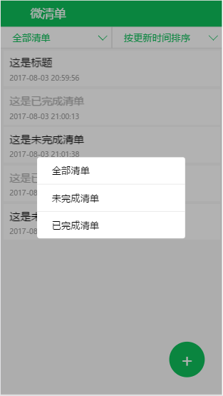
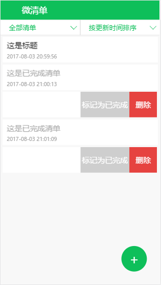
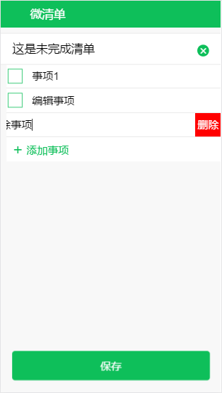

# 网页版印象笔记微清单

UI的设计来自印象笔记微清单微信小程序,Demo地址请看[Demo](https://jasery.github.io/Micro-TodoList/dist/index.html)
> 此demo会把数据保存到浏览器，如果不清空浏览器的缓存下次再次打开还会保留数据


## 安装
1. 先把仓库clone到本地
``` bash
git clone https://github.com/Jasery/Micro-TodoList.git ./MircoTodoList
```
2. 安装依赖
``` bash
cd MicroTodoList
# 自行安装好node
npm install 
```
3. 运行本地调试
``` bash
npm run dev
```
> 会自动打开浏览器，注意要打开浏览器的调试工具将页面设置成手机模式，chrome为例参考下图




## 图片参考







## 联系
### ISSUE